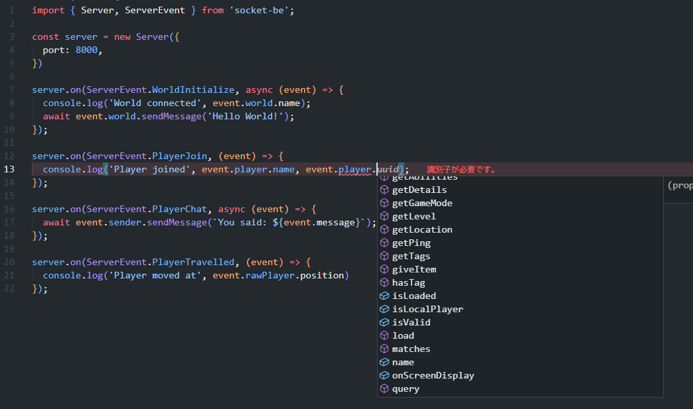

**English** | [日本語](./README_ja.md)

# SocketBE
A powerful websocket library to interact with MCBE WebSocket Protocol  
  
  
  

## Features
- Fully typed vanilla event handler
- Command execution + Handling responses
- Multiple connection support
- Various wrapper APIs (World, Player, Scoreboard, etc.)
- Encryption support

## Installation:
Requires Node.js v18 or later.
```bash
npm install socket-be
```

> **Note**: Bun is not fully compatible due to issues with encryption processing. You may be able to use SocketBE with Bun if you disable encryption (`{ encryption: false }` in server options), but full functionality is not guaranteed.

## Running:
If you use this inside same device, allow the loopback connection.  
`CheckNetIsolation.exe LoopbackExempt -a -n="Microsoft.MinecraftUWP_8wekyb3d8bbwe"`  
    
You can use `/wsserver` or `/connect` command to connect with websocket server.  
EX: `/wsserver <IP Address>:<PORT>`  

> **Note**: SocketBE cannot be used with Bedrock Dedicated Server (BDS) as it does not support the WebSocket protocol.  
  
## Usage
- Outputs received messages in console, and send back to mc  
```js
import { Server, ServerEvent } from 'socket-be';

const server = new Server({ port: 8000 })

server.on(ServerEvent.Open, () => {
  console.log('Server started')
});

server.on(ServerEvent.PlayerChat, async ev => {
  const { sender, message, world } = ev;

  if (sender.name === 'External') return; // prevents spam loop

  console.log(`<${sender.name}> ${message}`);

  if (message === 'ping') {
    await world.sendMessage('Pong!');
  }
});
```

## License
This project is licensed under the GPL-3.0 License.