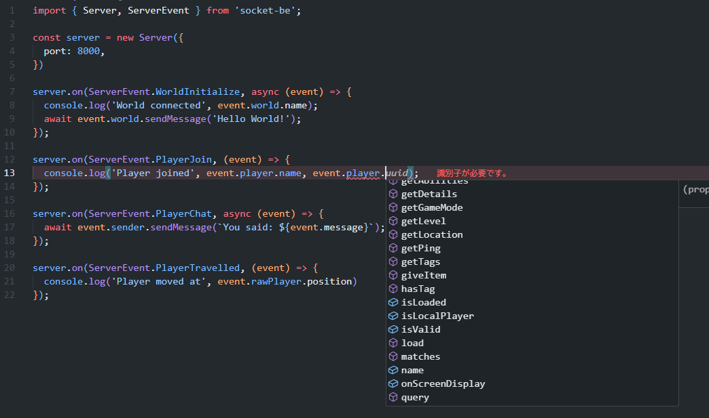

**English** | [日本語](./README_ja.md)

# SocketBE
A powerful websocket library for interacting with the MCBE WebSocket Protocol



## Features
- Fully typed vanilla event handler
- Command execution + Handling responses
- Multiple connection support
- Various wrapper APIs (World, Player, Scoreboard, etc.)
- Encryption support

## Installation:
Requires Node.js v18 or later.
```bash
npm install socket-be
```
```bash
pnpm add socket-be
```
```bash
bun add socket-be
```

## Connecting from Minecraft:
You can use either the `/wsserver` or `/connect` command to connect to the WebSocket server.

**Command Usage:** `/wsserver <HOST>:<PORT>`

**Example:** `/wsserver localhost:8000`

## Usage
```js
import { Server, ServerEvent } from 'socket-be';

const server = new Server({ port: 8000 });

server.on(ServerEvent.Open, () => {
  console.log('Server started');
});

// Outputs received messages to the console and sends them back to Minecraft
server.on(ServerEvent.PlayerChat, async (ev) => {
  const { sender, message, world } = ev;

  console.log(`<${sender.name}> ${message}`);

  await world.sendMessage(`You said: ${message}`);
});
```

```js
// Log player joins and leaves
server.on(ServerEvent.PlayerJoin, (ev) => {
  console.log(`${ev.player.name} joined the game`);
});

server.on(ServerEvent.PlayerLeave, (ev) => {
  console.log(`${ev.player.name} left the game`);
});
```

```js
// Execute a command
server.on(ServerEvent.PlayerChat, async (ev) => {
  const { message, world } = ev;

  if (message === '!diamond') {
    await world.runCommand('give @a diamond');
  }
});
```

Also DeepWiki is available at: https://deepwiki.com/tutinoko2048/SocketBE

## License
This project is licensed under the MIT License.
