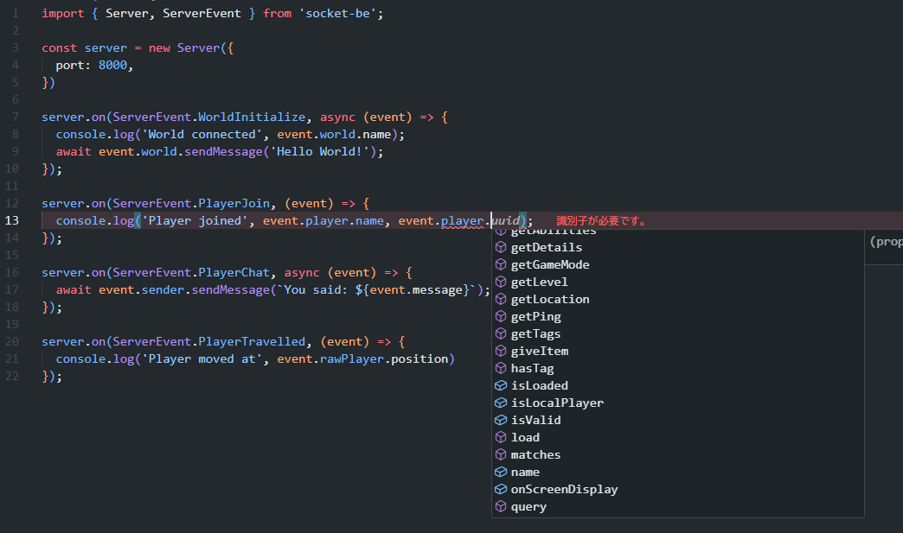

[English](./README.md) | **日本語**

# SocketBE
Minecraft統合版のWebSocketプロトコルと通信するためのライブラリです。  
  
  

## 特徴
- マイクラ側のイベントを簡単に登録できる(型はすべて定義済み)
- コマンドの実行とそのレスポンスの受け取り
- 複数接続のサポート
- World, Player, Scoreboardなどを包んだAPI
- 暗号化された接続のサポート

## インストール:
Node.js v18以上が必要です。  
```bash
npm i socket-be
```
  
## 繋いでみよう
同じPC内で接続する場合はループバック接続を許可してください
`CheckNetIsolation.exe LoopbackExempt -a -n="Microsoft.MinecraftUWP_8wekyb3d8bbwe"`  
   
マイクラとの接続には `/wsserver` または `/connect` コマンドを使用します  
EX: `/wsserver <IPアドレス>:<ポート>`  
繋がらない時はファイアウォールの設定も確認してみてください。  
  
## 使用例
- 送られたメッセージをコンソールに出力、そのまま送り返す  
```js
import { Server, ServerEvent } from 'socket-be';

const server = new Server({ port: 8000 })

server.on(ServerEvent.Open, () => {
  console.log('Server started')
});

server.on(ServerEvent.PlayerChat, async ev => {
  const { sender, message, world } = ev;

  if (sender.name === '外部') return; // prevents spam loop

  console.log(`<${sender.name}> ${message}`);

  if (message === 'ping') {
    await world.sendMessage('Pong!');
  }
});
```

## License
このプロジェクトはGPL-3.0の下でライセンスされています。